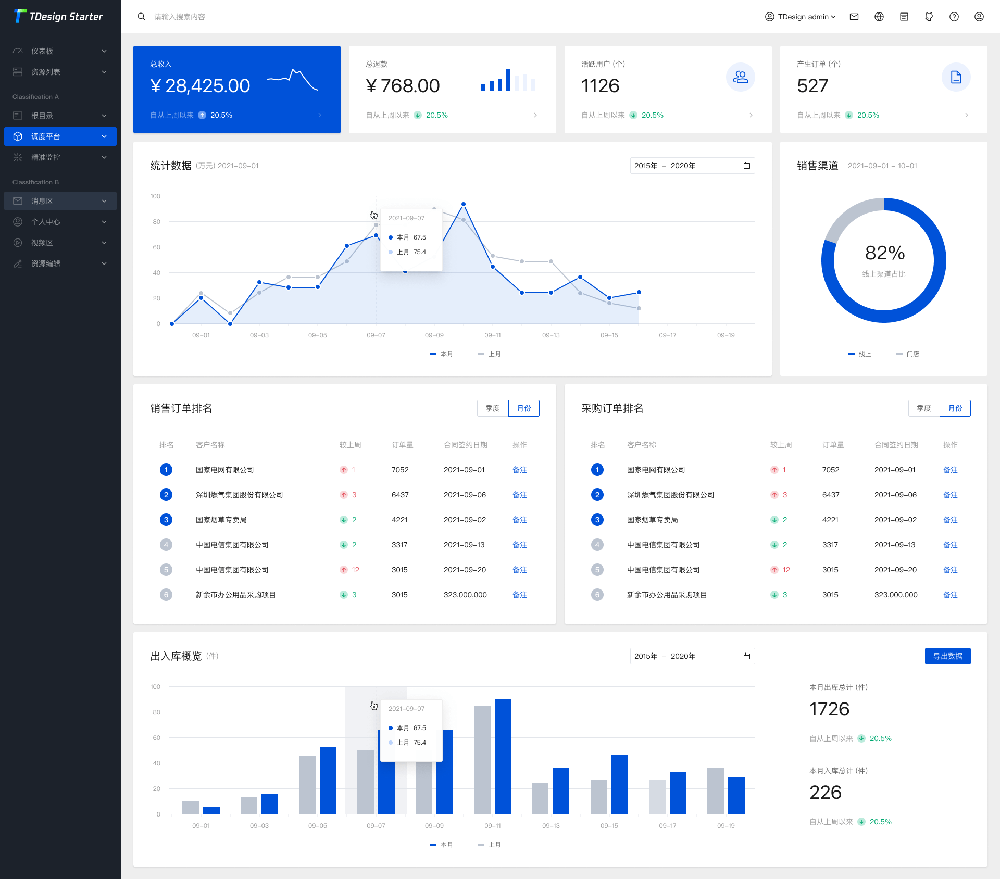

<p style="display:flex; justify-content: center">

</p>
<p align="center">
  <a href="https://tdesign.tencent.com/starter/vue-next/#/dashboard/base" target="_blank">
    
  </a>
</p>

<p align="center">
  <a href="https://nodejs.org/en/about/releases/"></a>
  <a href="https://github.com/Tencent/tdesign-vue-next/blob/develop/LICENSE">
    
  </a>
</p>

简体中文 | [English](./README.md)

### 项目简介

TDesign Vue Next Starter 是一个基于 TDesign，使用 `Vue3`、`Vite`、`Pinia`、`TypeScript` 开发，可进行个性化主题配置，旨在提供项目开箱即用的、配置式的中后台项目。

<p>
  <a href="http://tdesign.tencent.com/starter/vue-next/">在线预览</a>
  ·
  <a href="https://tdesign.tencent.com/starter/">使用文档</a>

</p>



### 特性

- 内置多种常用的中后台页面
- 完善的目录结构
- 完善的代码规范配置
- 支持深色模式
- 自定义主题颜色
- 多种空间布局
- 内置 Mock 数据方案

### 使用

> 通过 `tdesign-starter-cli` 初始化项目仓库

```bash
## 1、安装 tdesign-starter-cli
npm i tdesign-starter-cli@latest -g

## 2、创建项目
td-starter init
```

### 开发

```bash
## 安装依赖
npm install

## 启动项目
npm run dev
```

### 本地使用生产域名调试

如果需要在浏览器打开 `https://enterprise.lingjieyun.com/` 时访问本地前端开发环境，推荐按下面方式配置。

1. 生成本地域名证书（示例使用 `mkcert`）

```bash
mkcert -install
mkcert enterprise.lingjieyun.com
```

2. 修改本机 `hosts`

```txt
127.0.0.1 enterprise.lingjieyun.com
```

3. 在项目根目录创建 `.env.development.local`

如果你接受带端口访问，直接让 Vite 提供 HTTPS：

```bash
VITE_DEV_HOST = 0.0.0.0
VITE_DEV_PORT = 3002
VITE_DEV_ALLOWED_HOST = enterprise.lingjieyun.com
VITE_DEV_HTTPS = true
VITE_DEV_SSL_KEY = ./certs/enterprise.lingjieyun.com-key.pem
VITE_DEV_SSL_CERT = ./certs/enterprise.lingjieyun.com.pem
VITE_DEV_HMR_HOST = enterprise.lingjieyun.com
```

这时访问 `https://enterprise.lingjieyun.com:3002/`。

如果你必须使用不带端口的精确地址 `https://enterprise.lingjieyun.com/`，让 Vite 跑在本地开发端口，再用 Caddy/Nginx 监听 `443` 反向代理到 Vite：

```bash
VITE_DEV_HOST = 0.0.0.0
VITE_DEV_PORT = 3002
VITE_DEV_ALLOWED_HOST = enterprise.lingjieyun.com
VITE_DEV_HMR_HOST = enterprise.lingjieyun.com
VITE_DEV_HMR_PROTOCOL = wss
VITE_DEV_HMR_CLIENT_PORT = 443
```

4. 使用反向代理接入 `443`（推荐 Caddy）

```caddyfile
enterprise.lingjieyun.com {
  tls /绝对路径/certs/enterprise.lingjieyun.com.pem /绝对路径/certs/enterprise.lingjieyun.com-key.pem
  reverse_proxy 127.0.0.1:3002
}
```

5. 启动企业端开发环境

```bash
npm run dev:enterprise
```

说明：

- 项目里的接口默认走相对路径 `/api`，再由 Vite 开发代理转发到后端，所以这种域名映射方式不会破坏现有接口请求。
- 如果使用微信登录或第三方回调，这种方式可以直接复用代码里写死的 `https://enterprise.lingjieyun.com/...` 回调地址。

### 构建

```bash
## 构建正式环境
npm run build

## 构建测试环境
npm run build:test
```

### 其他

```bash
## 预览构建产物
npm run preview

## 代码格式检查
npm run lint

## 代码格式检查与自动修复
npm run lint:fix

## style格式检查
npm run stylelint

## style格式检查与自动修复
npm run stylelint:fix
```

### 如何贡献

非常欢迎您的贡献！提交您的 [Issue](https://github.com/tencent/tdesign-vue-next-starter/issues/new/choose) 或者提交 [Pull Request](https://github.com/Tencent/tdesign-vue-next-starter/pulls)。

#### 贡献提交规范

- [Angular Convention](https://github.com/conventional-changelog/conventional-changelog/tree/master/packages/conventional-changelog-angular)
- [Vue Style Guide](https://v3.vuejs.org/style-guide/#rule-categories)

### 兼容性

| [](http://godban.github.io/browsers-support-badges/)</br> IE / Edge | [](http://godban.github.io/browsers-support-badges/)</br>Firefox | [](http://godban.github.io/browsers-support-badges/)</br>Chrome | [](http://godban.github.io/browsers-support-badges/)</br>Safari |
| ---------------------------------------------------------------------------------------------------------------------------------------------------------------------------------------------------------------- | ----------------------------------------------------------------------------------------------------------------------------------------------------------------------------------------------------------------- | ------------------------------------------------------------------------------------------------------------------------------------------------------------------------------------------------------------- | ------------------------------------------------------------------------------------------------------------------------------------------------------------------------------------------------------------- |
| Edge >=84                                                                                                                                                                                                        | Firefox >=83                                                                                                                                                                                                      | Chrome >=84                                                                                                                                                                                                   | Safari >=14.1                                                                                                                                                                                                 |

### 社区版本

基于 TDesign Vue Next 的 starter-kit 有多种社区版本，访问 [社区链接](https://tdesign.tencent.com/starter/docs/vue-next/community-link) 可以访问更多版本。
如果您也开发了 TDesign Starter 的社区版本，可以提交 Issue 或者直接给我们提Pull Request 😊。

### 开源协议

TDesign 遵循 [MIT 协议](https://github.com/Tencent/tdesign-vue-next-starter/LICENSE)。
